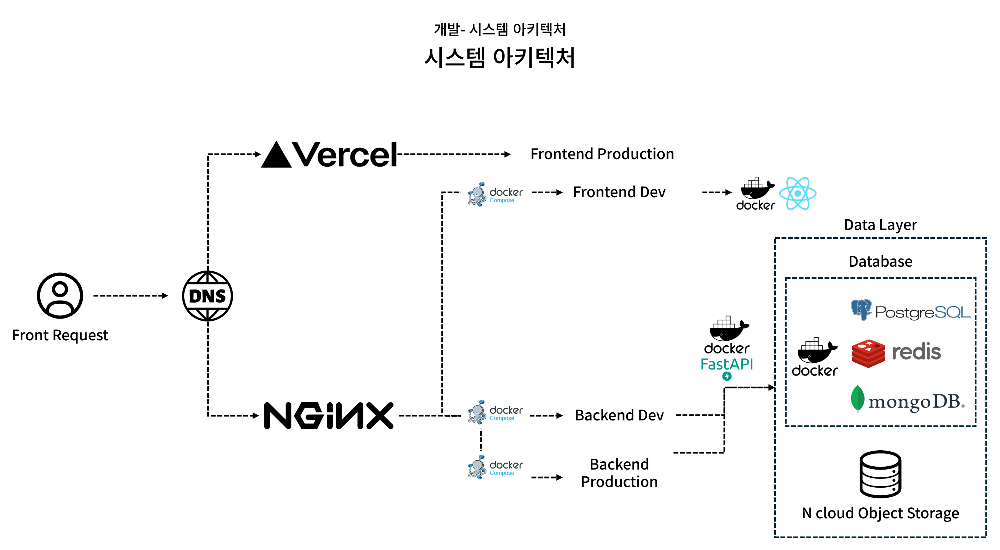
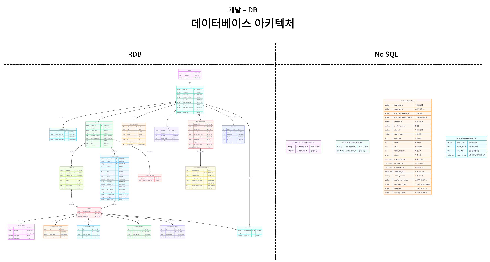
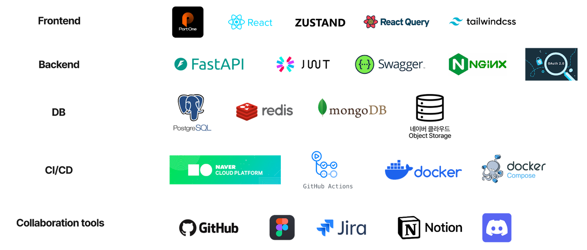
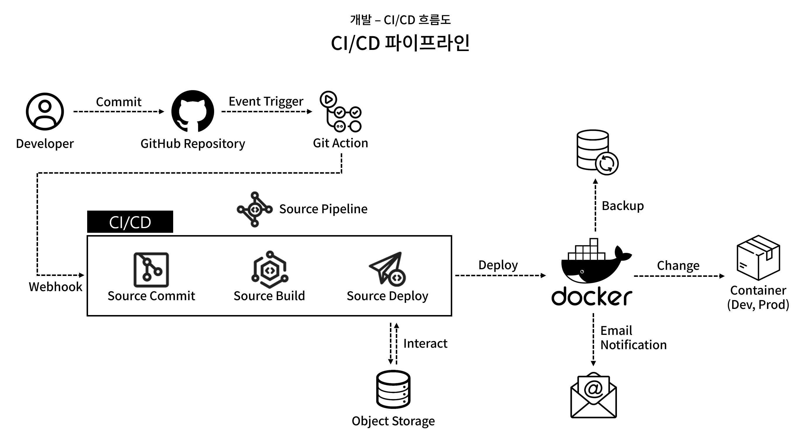

  

  

<b>가까운 매장에서 실시간으로</b>
 
<b>샐러드 랜덤팩을 주문하고 픽업하세요!</b>

  <a href="https://nodejs.org/">Node 18+</a> ·
  <a href="https://fastapi.tiangolo.com/">FastAPI</a> ·
  <a href="https://www.postgresql.org/">PostgreSQL</a> ·
  <a href="https://www.mongodb.com/">MongoDB</a> ·
  <a href="https://redis.io/">Redis</a> ·
  <a href="https://vitejs.dev/">Vite</a> ·
  <a href="https://pnpm.io/">pnpm</a> ·
  <a href="https://www.docker.com/">Docker</a> ·
  <a href="https://docs.github.com/ko/actions">GitHub Actions</a> ·
  OAuth 2.0 (<a href="https://developers.naver.com/docs/login/api/api.md">Naver</a>/<a href="https://developers.google.com/identity/protocols/oauth2?hl=ko">Google</a>)

---

## 목차

- [프로젝트 개요](#-프로젝트-개요)
- [기능 요약](#-기능-요약)
- [아키텍처](#-아키텍처)
- [기술 스택](#-기술-스택)
- [레포지토리 구조](#-레포지토리-구조)
- [도메인/DB 개요](#-도메인db-개요)
- [스케줄러 작업](#-스케줄러-작업)
- [보안/인증](#-보안인증)
- [CI/CD](#-cicd)
- [기여](#-기여)
- [라이선스](#-라이선스)

---

## 📌 프로젝트 개요

**저렴한끼(Cheap-Bob)** 폐기할 샐러드로 건강한 한끼를 저렴하게.
마감세일 샐러드 랜덤판매 플랫폼입니다.

- 소비자: 프리미엄 샐러드/포케를 **저렴하게 선구매 → 픽업**
- 판매자: 폐기 직전 재고를 **수익화 → 폐기율/원가 손실 감소**
- 사회적 가치: **음식물 쓰레기 저감, ESG 실천, 1인 가구 건강 증진**

---

## ✨ 기능 요약

- 🥬 **마감세일 랜덤팩**: 매장별 남는 재료 기반 랜덤 구성/고정가 판매
- 🕒 **주문 상태 추적**: 예약 → 수락 → 완료/취소 실시간 확인
- 📱 **QR 픽업 인증**: 인앱 스캐너로 수령 시점 인증/로그 남김
- 👤 **개인화**: 영양 목표/선호 토핑/알레르기 기반 추천
- 🔁 **자동화 스케줄링**: 마감 자동 환불, 재고 초기화, 결제 이탈 복구 등
- 📧 **이메일 알림**: 주문/수락/취소 비동기 메일 발송(BackgroundTasks)

---

## 🏗 아키텍처

  
  

---

## 🧰 기술 스택

| 영역             | 사용 기술                                                                                             |
| ---------------- | ----------------------------------------------------------------------------------------------------- |
| **Frontend**     | React, Vite, TypeScript, pnpm, TailwindCSS                                                            |
| **Backend**      | FastAPI, Pydantic, SQLAlchemy, Beanie                                                                 |
| **DB/Cache**     | PostgreSQL, MongoDB, Redis                                                                            |
| **Infra/DevOps** | Docker, GitHub Actions, Object Storage(백업), Naver Cloud                                             |
| **Auth**         | OAuth 2.0 (Naver/ Google), JWT                                                                        |
| **기타**         | APScheduler, BackgroundTasks(메일), In-Web QR Scanner, Naver Map API, Daum Map API, Daum Postcode API |

  

---

## 📂 레포지토리 구조

- [Frontend](./frontend/README.md)
- [Backend](./backend/README.md)

---

## 🧠 도메인/DB 개요

- **Seller/Store**: 매장, 운영정보(요일별 영업/픽업), 주소, 결제설정, SNS
- **Product**: 가격/할인율/재고/버전관리(낙관적 락), 영양정보(N:N)
- **Customer**: 상세/즐겨찾기/선호 메뉴·토핑·영양·알레르기
- **Order**: 장바구니 → 주문(예약/수락/완료/취소), 시점 스냅샷(가격/할인/선호)
- **Logs**: 픽업 QR 인증, 상태 전이 이력, 메일 발송 결과

---

## ⏱ 스케줄러 작업

- **가게 마감 시**: 수락 중 주문 **자동 완료 처리**
- **픽업 마감 시**: 예약 상태 주문 **자동 환불 처리**
- **매일 04시**: **재고 초기화**, 운영정보 예약반영, 탈퇴 요청 사용자 삭제
- **결제 이탈**: 장시간 결제 점유 시 **재고 복구 + 주문 권한 취소**
- **장애 복구**: 서버 다운 중 누락된 주문 **보정 환불**

---

## 🔐 보안/인증

- **OAuth 2.0**: Naver(승인 완료) / Google(승인 진행)
- **JWT**: 액세스 토큰 암·복호화, 만료/블랙리스트 전략
- **권한**: 소비자/판매자 분리, 엔드포인트 스코프 기반 접근 제어
- **백업**: 배포 산출물 zip → Object Storage 보관

---

## 🚚 CI/CD

- **GitHub Actions**: PR 검사/빌드/테스트/이미지 빌드
- **Webhook**: 배포 서버/SourceCommit 파이프라인 트리거
- **배포**: Docker 컨테이너 **무중단 교체(blue/green 또는 rolling)**
- **아티팩트**: 빌드 산출물 zip을 Object Storage에 보관(롤백 대비)

  

---

## 👥 Contributor

|                       Backend                       |                 Frontend                  |
| :-------------------------------------------------: | :---------------------------------------: |
| [Hyeonsang Cho](https://github.com/hyeonsang010716) | [gimgyuwon](https://github.com/gimgyuwon) |

---

## 📜 라이선스

MIT License © 2025 **저렴한끼 (Cheap-Bob)**
