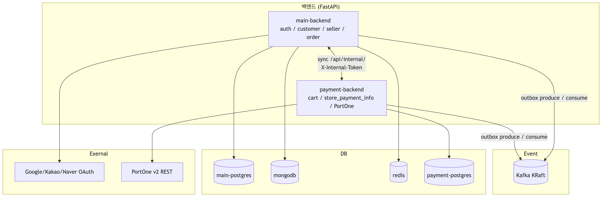
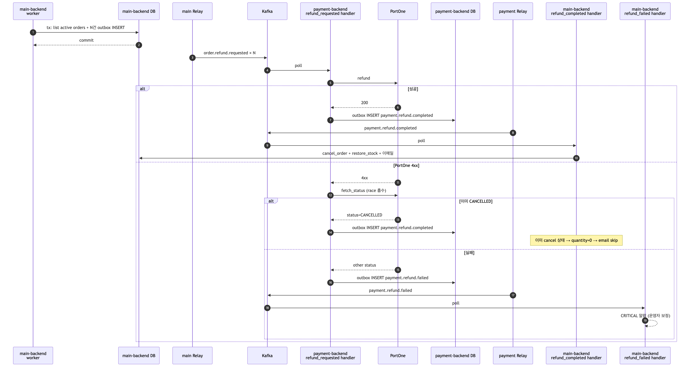
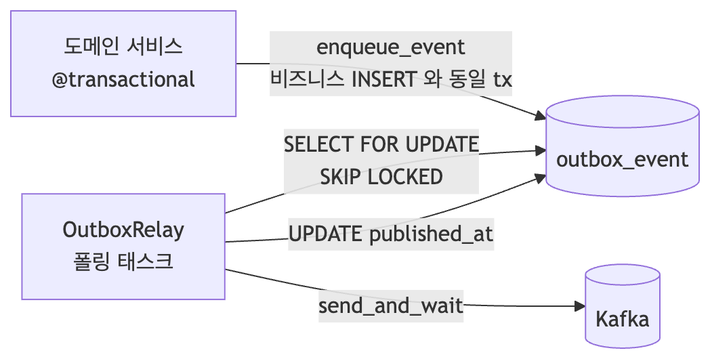
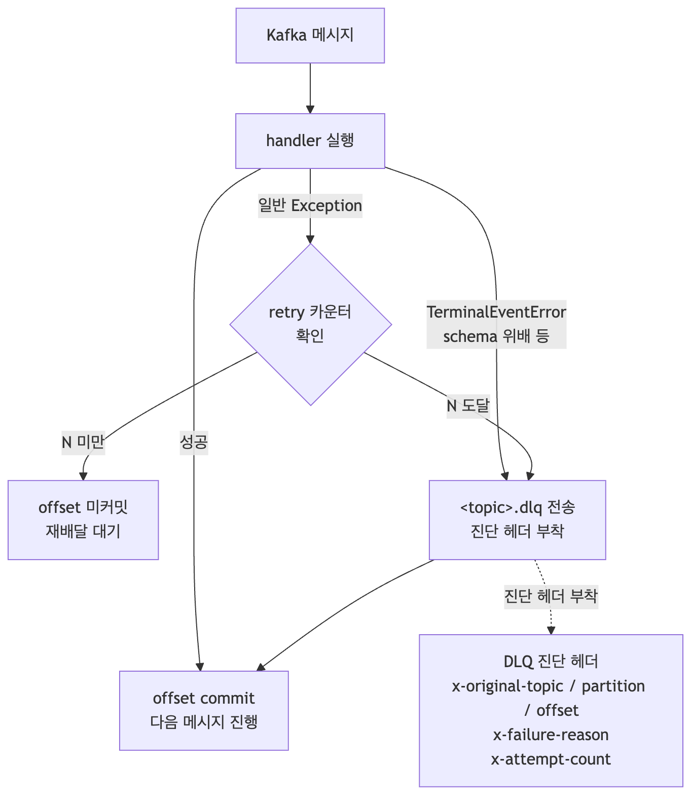

# MSA Event Backend

**Outbox 패턴 + Kafka 이벤트 Saga + DLQ + Circuit Breaker 까지 갖춘 이벤트 드리븐 백엔드.** <br>
FastAPI 기반 2-서비스 MSA로, 메시지 중복·유실·정체를 모두 차단한 production-ready 신뢰성 인프라.

> **도메인 컨텍스트**: 마감 임박 음식 픽업 주문 플랫폼. <br>셀러가 가게 마감 전 남은 음식 등록 → 고객 픽업 시간대 결제 + 수령. PortOne 결제 도메인은 별도 backend 로 분리, 두 서비스 사이는 Kafka 이벤트 + 동기 internal API 혼용.

---

## 아키텍처



핵심: **결제는 payment-backend 가 단독 소유**. main-backend 가 PortOne 호출하지 않는다. 두 서비스 사이 통신은 (1) 즉시성 필요한 read/write 는 sync HTTP (`/api/internal/*` + 토큰), (2) 비즈니스 부수효과 / 자동 retry 가 필요한 흐름은 Kafka 이벤트.

---

## 두 서비스 분담

| | main-backend | payment-backend |
|---|---|---|
| 포트 | 8000 | 8001 |
| 데이터 | main-postgres + mongodb + redis | payment-postgres |
| 도메인 | auth, customer, seller, order | payment (StorePaymentInfo, CartItem) |
| 외부 의존 | Google/Kakao/Naver OAuth, AWS S3, SMTP | PortOne v2 REST |
| 스케줄러 | 재고 리셋 · 운영정보 반영 · 미완료 환불 재시도 · 픽업 마감 자동취소 · history 이관 | cart 만료 정리 |
| 발행 토픽 | `seller.store.withdrawn`, `order.refund.requested` | `payment.refund.completed`, `payment.refund.failed` |
| 소비 토픽 | `payment.refund.completed`, `payment.refund.failed` | `seller.store.withdrawn`, `order.refund.requested` |

---

## 환불 Saga 흐름

가게 마감 / 픽업 마감 자동 환불 시나리오. **사용자 응답 시간이 주문 개수에 비례하지 않도록 막는다**.



**핵심 보장:**
- **No dual-write** — 한 트랜잭션에서 비즈니스 INSERT 와 outbox INSERT 가 함께 커밋
- **결제 단위 순서 보장** — partition key `aggregate_id=payment_id`
- **Effectively-once** — 양쪽 consumer `ProcessedEvent` ledger 로 at-least-once 중복 흡수
- **False CRITICAL 방지** — PortOne 4xx 시 `fetch_status` 재조회로 race 흡수

---

## 신뢰성 인프라

### Outbox



`stock_operation_log` 와 같은 PK 멱등 패턴을 ledger 에 적용.

### DLQ



`CONSUMER_MAX_ATTEMPTS=5`. partition stall 차단이 핵심 — 한 잘못된 메시지가 후속 메시지 처리를 막지 않는다.

### Circuit Breaker

4개 외부 의존성마다 인스턴스:

| 위치 | breaker |
|---|---|
| main-backend → payment-backend | `payment-backend` |
| payment-backend → main-backend.seller | `main-backend:seller` |
| payment-backend → main-backend.order | `main-backend:order` |
| payment-backend → PortOne | `portone` |

`/health` 에서 state snapshot 노출. `CLOSED → OPEN`(N 연속 실패) `→ HALF_OPEN`(recovery_timeout 경과) `→ CLOSED` 또는 `OPEN`.

---

## 디렉토리

```
.
├── docker-compose.yml          # 9 서비스 — main-postgres, payment-postgres, mongo, redis, kafka, kafka-init, kafka-ui, 두 backend
│
├── main-backend/
│   ├── app/
│   │   ├── api/
│   │   │   ├── v1/router.py            # /api/v1 외부 API 집계
│   │   │   └── internal/router.py      # /api/internal service-to-service
│   │   ├── domain/
│   │   │   ├── auth/                   # OAuth + JWT
│   │   │   ├── customer/
│   │   │   ├── seller/
│   │   │   │   ├── event/withdrawn.py  # outbox 이벤트 schema
│   │   │   │   └── service/seller_withdraw.py  # → outbox enqueue
│   │   │   └── order/
│   │   │       ├── event/              # refund saga schemas + 핸들러
│   │   │       ├── worker/             # 스케줄러 워커 (모두 이벤트 발행)
│   │   │       └── service/seller_order.py
│   │   ├── core/
│   │   │   ├── kafka/                  # producer + consumer + DLQ
│   │   │   ├── outbox/                 # model + repo + relay + enqueue
│   │   │   ├── resilience/             # CircuitBreaker + retry
│   │   │   └── internal_client/        # payment-backend HTTP 클라이언트
│   │   ├── container.py                # dependency_injector DI
│   │   └── main.py                     # lifespan: scheduler + relay + consumer
│   ├── migration/versions/             # alembic
│   └── test/unit/                      # tests
│
└── payment-backend/                    # 동일 구조 (단, scheduler 는 cart sweeper 만)
    ├── app/
    │   ├── domain/payment/
    │   │   ├── event/                  # refund saga + seller_withdrawn 핸들러
    │   │   └── service/
    │   ├── core/                       # kafka/outbox/resilience 미러
    │   ├── container.py
    │   └── main.py
    ├── migration/versions/
    └── test/unit/                      # tests
```

---

## 컨벤션

| 영역 | 규칙 |
|---|---|
| **shared 패턴 미적용** | payload schema 를 양 서비스에 동일하게 자체 정의. 계약 변경 시 양쪽 동시 수정 |
| **트랜잭션 경계** | `@transactional` 데코레이터 + `ContextVar` 로 nested 안전. service / repo 호출 자동 같은 세션 |
| **outbox enqueue** | `await enqueue_event(self._session, ...)` — `@transactional` 안에서 호출하면 비즈니스 데이터와 함께 commit |
| **handler 시그니처** | `async def handle(self, msg: ConsumerRecord) -> None`. 영구 실패는 `TerminalEventError` raise → DLQ |
| **partition key** | `aggregate_id` — 같은 aggregate 의 이벤트 순서 보장 (예: `payment_id`) |
| **schema 버전** | 헤더에 `schema_version="<n>"`. payload echo 는 `Payload(**other.model_dump())` 패턴으로 누락 사고 방지 |
| **CRITICAL 로깅** | 운영자 보정이 필요한 시그널만. `[CRITICAL]` prefix 로 알람 룰이 grep |
| **dead-letter 검사** | kafka-ui (http://localhost:8090) 또는 `kafka-console-consumer ... --topic <name>.dlq` |

---

## 개발 시작

```bash
# 1. .env 파일 (예시는 .env.example 참고)
cp main-backend/.env.example main-backend/.env
cp payment-backend/.env.example payment-backend/.env
# → 필요한 값 채우기 (OAuth, AWS, SMTP, PortOne 등)

# 2. 인프라 + 두 백엔드 기동
docker compose up -d
# kafka-init 가 토픽 8개 (4 비즈니스 + 4 DLQ) 명시 생성 후 종료
# 두 backend 가 차례로 healthy

# 3. 마이그레이션
docker compose exec main-backend uv run alembic upgrade head
docker compose exec payment-backend uv run alembic upgrade head

# 4. health 확인
curl localhost:8000/health    # main-backend
curl localhost:8001/health    # payment-backend

# 5. kafka-ui — 토픽 / consumer group / DLQ 메시지 보기
open http://localhost:8090
```

### 단위 테스트

```bash
# 컨테이너 안에서
docker exec cheapbob-main-backend bash -c "cd /main-backend && uv run pytest test/unit"
docker exec cheapbob-payment-backend bash -c "cd /payment-backend && uv run pytest test/unit"
```

---

## 운영 메모

### Kafka 토픽 (비즈니스 + DLQ)

```
seller.store.withdrawn       seller.store.withdrawn.dlq
order.refund.requested       order.refund.requested.dlq
payment.refund.completed     payment.refund.completed.dlq
payment.refund.failed        payment.refund.failed.dlq
```

DLQ retention 30일 (조사 / replay 시간 확보).